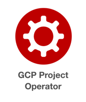

# GCP Project Operator

[](https://goreportcard.com/report/github.com/openshift/gcp-project-operator)

[](https://pkg.go.dev/mod/github.com/openshift/gcp-project-operator)
[](http://www.apache.org/licenses/LICENSE-2.0.html)

[](https://github.com/openshift/gcp-project-operator)

----
GCP Project Operator is an open source project responsible for creating and destroying projects and service accounts in GCP.
It stores the credentials in a secret, so other Kubernetes applications (_operators_) can use them and interact with GCP to create cloud resources or any other underlying infrastructure (_such as storage or virtual machines_).

GCP Project Operator is one of the operators used for provisioning [OpenShift Dedicated](https://www.openshift.com/products/dedicated/) clusters on [Google Cloud Platform](https://cloud.google.com/) managed by Red Hat Site-Reliability Engineers.

> You can get a quick overview of what's happening inside the Operator by watching [this video](https://www.youtube.com/watch?v=BQmvN9248sI).

If you like to contribute to GCP Project Operator, please be so kind to read our [Contribution Policy](./docs/CONTRIBUTING.md) first.

----

* [Info](#info)
   * [Documentation](#documentation)
      * [For Users](#for-users)
      * [For Developers](#for-developers)
   * [Workflow - ProjectClaim](#workflow---projectclaim)
      * [Example CR](#example-cr)
   * [Requirements](#requirements)
* [Deployment](#deployment)
   * [Building](#building)
   * [Local Dev](#local-dev)
      * [Prerequisites](#prerequisites)
      * [Start operator locally](#start-operator-locally)
   * [Configuration](#configuration)
      * [Auth Secret](#auth-secret)
      * [ConfigMap](#ConfigMap)

# Info

## Documentation

### For Users

* [Google GCP configuration](./docs/gcpconfig.md) -- The Operator expects a `ConfigMap` and a `Secret` to be already present in the cluster before you use it.
* [How to use it](./docs/userstory.md) -- Tell the Operator to create or delete a new GCP Project for you.
* [Debugging](./docs/debug.md) -- Useful tips and commands.
* [API](./docs/api.md) -- Options you can fine-tune for `ProjectClaim`.

### For Developers

* [Design](./docs/design.md) -- Describes the interaction between the custom resource definitions.
* [Building](./docs/building.md) -- Instructions for building the project.
* [Development](./docs/development.md) -- Instructions for developers who want to contribute.
* [Testing](./docs/testing.md) -- Instructions for writing tests.
* [Troubleshooting](./docs/troubleshooting.md) -- Common errors and pitfalls.
* [Code Analysis](./docs/analyze.md) -- A high-level analysis of the code to get yourself familiar with the codebase.


## Workflow - ProjectClaim

1. The operator watches all namespaces for `ProjectClaim` resources.
2. When a `ProjectClaim` is found (see example below) the operator triggers the creation of a project in GCP.
3. After successful project creation:
    * The field `State` will be set to `Ready`.
    * A secret is created in the cluster namespace, as defined in the `ProjectClaim`.
    * The field `spec.gcpProjectID` will be filled with the ID of the GCP project.
    * A list of available zones in the input region is set in `spec.availabilityZones`.
4. When a `ProjectClaim` is removed, the secret, the GCP project and its ServiceAccounts are deleted.
5. The operator removes the finalizer from the `ProjectClaim`.

### Example Input Custom Resource

```yaml
apiVersion: gcp.managed.openshift.io/v1alpha1
kind: ProjectClaim
metadata:
  name: example-projectclaim
  namespace: example-clusternamespace
spec:
  region: us-east1
  gcpCredentialSecret:
    name: gcp-secret
    namespace: example-clusternamespace
  legalEntity:
    name: example-legal-entity
    id: example-legal-entity-id
```

# Deployment

## Building

Just run `make`.

## Local Dev

### Prerequisites

* Typically you'll want to use [CRC](https://github.com/code-ready/crc/), though it's fine if you're running OpenShift another way.
* You need to have [the operator-sdk binary](https://github.com/operator-framework/operator-sdk/releases) in your `$PATH`.

### Start operator locally

```
oc new-project gcp-project-operator
oc apply -f deploy/crds/gcp.managed.openshift.io_projectclaims_crd.yaml
oc apply -f deploy/crds/gcp.managed.openshift.io_projectreferences_crd.yaml

operator-sdk up local --namespace gcp-project-operator
```

NOTE: The above command works with operator-sdk v0.11.0. If it fails to run, try using one of the older commands:

```
operator-sdk run --local --namespace gcp-project-operator
operator-sdk run local --watch-namespace gcp-project-operator
```

If everything went ok, you should see some startup logs from the operator in your terminal window.

There are example CRs in `deploy/crds/` you might want to use to see how the operator reacts to their presence (and absence if you delete them).

### Running tests

You can run the tests using `make gotest` or `go test ./...`

## Configuration

For the operator to interact with GCP properly, it needs a bit of configuration first.

Note: unless you're running this against your very own GCP org, **someone likely already has this stuff prepared for you.**
**Ask around.**

### Auth Secret

1. Create a gcp service account with appropriate permissions to an empty folder ("(Project) Owner" and "Project Creator" should suffice).
2. Generate keys for the service account and download them.
3. Run `oc create -n gcp-project-operator secret generic gcp-project-operator-credentials --from-file=key.json=YOUR-KEYS-FILE-NAME.json`

### Configmap

The controller expects to find a `ConfigMap` with the name `gcp-project-operator` inside the `gcp-project-operator` namespace.

For how to create a `ConfigMap`, please refer to the [doc](docs/gcpconfig.md).
