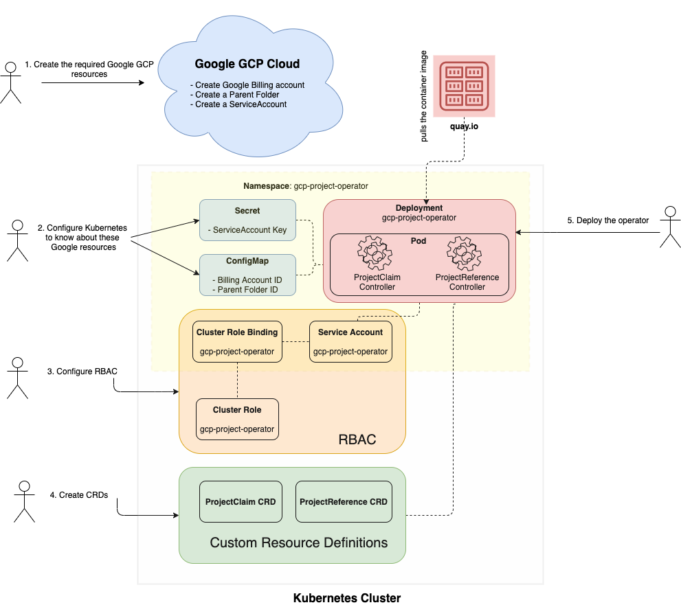

# How to use GCP Project Operator

### Prerequisites

* Have Kubernetes cluster up an running
* Have an active Google GCP account



## Configure Google GCP

The Operator expects you already have a BillingAccount in Google GCP cloud, a Parent Folder and a ServiceAccount.
If not, then please follow [these instructions](./gcpconfig.md) to do it.

## Configure Kubernetes cluster

The Operator expects some pre-existing configuration into your Kubernetes cluster that is related to your account in Google GCP cloud.
That configuration is:

* A `ConfigMap` gcp-project-operator: _To use your Google billing account data_
* A `secret` gcp-project-operator-credentials: _To utilize your Google ServiceAccount in order to be able to interact with instances_.

Follow [these instructions](./gcpconfig.md) to create both the `ConfigMap` and the `secret` required, if you haven't done it already.

## Install the Operator into the cluster

### Install the RBAC configuration

```kube
kubectl apply -f deploy/cluster_role_binding.yaml
kubectl apply -f deploy/cluster_role.yaml
kubectl apply -f deploy/service_account.yaml
```

### Install the CRDs

```zsh
kubectl create -f deploy/crds/gcp.managed.openshift.io_projectclaims_crd.yaml
kubectl create -f deploy/crds/gcp.managed.openshift.io_projectreferences_crd.yaml
```

### Install the Operator

```kube
kubectl apply -f deploy/operator.yaml
```

## Use the Operator

### Create a GCP Project

Create a new `ProjectClaim` signaling your request to the Operator.
For example:

```kube
kubectl create -f deploy/crds/gcp.managed.openshift.io_v1alpha1_projectclaim_cr.yaml
```

### Delete a GCP Project

Delete the already created `ProjectClaim` instance.
This will propagate the request to Google GCP and it will delete the GCP Project that is linked to that.

```kube
kubectl delete -f deploy/crds/gcp.managed.openshift.io_v1alpha1_projectclaim_cr.yaml
```
